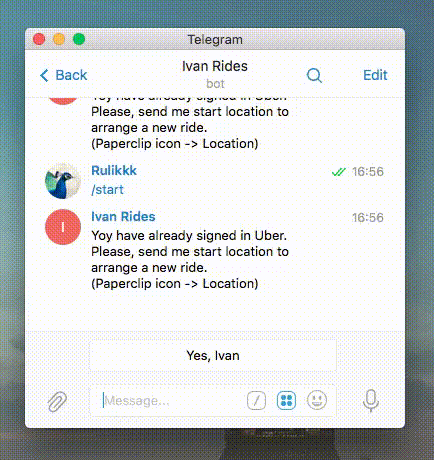

This page describes how to use the [{{ site.data.bot.display }}][bot-url] bot.

### How to start
To start, open [this link][bot-url] or look for `{{ site.data.bot.name }}` in your telegram. You will see a welcome message from the bot — just follow its guidance to login to Uber.

### How to book a ride
The bot reacts to any location sent to it and asks to get an Uber there.

This can be achieved using several ways:

- By **sharing your location**.
- By forwarding some location to the bot, useful when a friend asks to book a ride and shares his or her location with you.
- By using `@foursquare` inline bot, useful when you need a car for someone, e.g. use `@foursquare venue-name` if you need a car near that venue.

_At any time, you may cancel you request using the following command:_ `/cancel`.

[bot-url]: {{ site.data.bot.url }}

